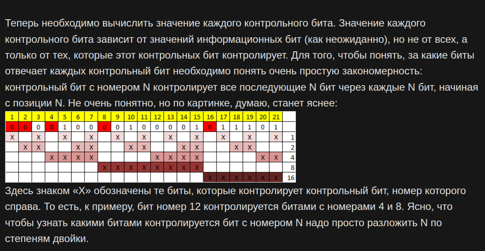

# Кодирование помехоустойчивое. Код Хэмминга 

https://habr.com/ru/articles/140611/

Коды Хэмминга — наиболее известные и, вероятно, первые из самоконтролирующихся и самокорректирующихся кодов. Построены они применительно к двоичной системе счисления.

Другими словами, это алгоритм, который позволяет закодировать какое-либо информационное сообщение определённым образом и после передачи (например по сети) определить появилась ли какая-то ошибка в этом сообщении (к примеру из-за помех) и, при возможности, восстановить это сообщение. Сегодня, я опишу самый простой алгоритм Хемминга, который может исправлять лишь одну ошибку.

